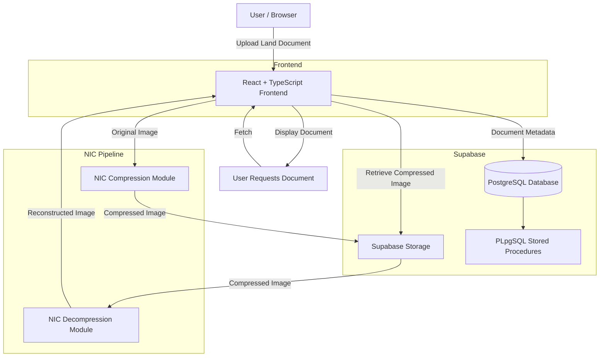
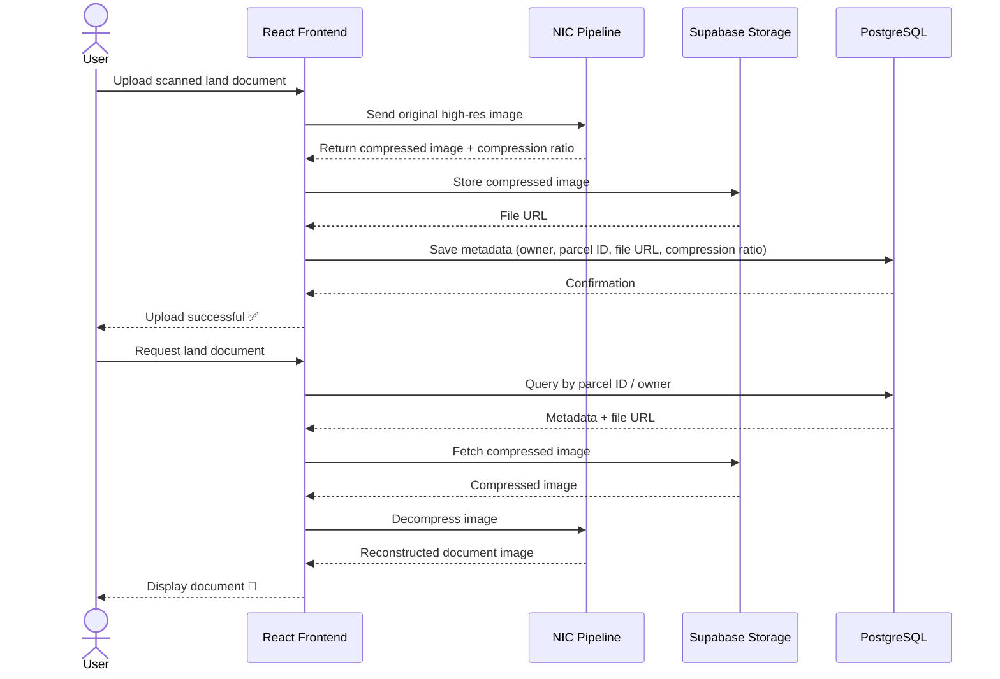
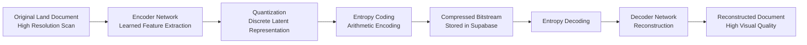
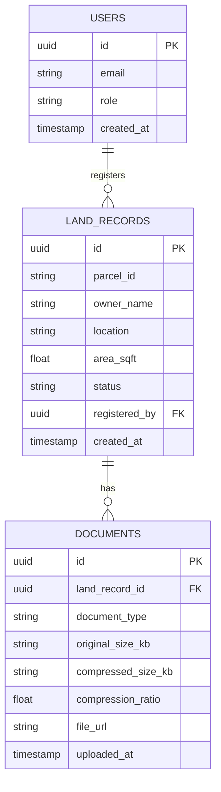

#  LandRegistry-NIC

> A full-stack Land Registry Management System that leverages **Neural Image Compression (NIC)** to efficiently store and retrieve large-scale land document images — reducing storage overhead while preserving document quality.

---

##  Overview

Land registry systems deal with massive volumes of scanned documents — title deeds, survey maps, ownership certificates — that are large in size and expensive to store. LandRegistry-NIC solves this by integrating **Neural Image Compression** into the document storage pipeline, compressing high-resolution land documents intelligently before storing them in the cloud, and decompressing them on retrieval — all through a modern, responsive web interface.

---

##  Features

-  **Neural Image Compression** — Compresses large land document images using learned compression models before cloud storage
-  **Document Upload & Retrieval** — Upload scanned land documents, store compressed versions, retrieve and decompress on demand
-  **Structured Record Management** — Normalized PostgreSQL schema via Supabase for land record metadata
-  **Secure Access** — Role-based authentication for admins, officers, and citizens
-  **Compression Metrics** — Track compression ratio and file size reduction per document
-  **Responsive UI** — Mobile-friendly interface built with Tailwind CSS
-  **Fast Build** — Powered by Vite for instant development experience

---

##  Tech Stack

| Layer | Technology |
|---|---|
| Frontend | React + TypeScript |
| Styling | Tailwind CSS |
| Build Tool | Vite |
| Backend / DB | Supabase (PostgreSQL) |
| DB Logic | PLpgSQL (stored procedures) |
| Storage | Supabase Storage |
| Compression | Neural Image Compression (NIC) |
| Package Manager | Bun |

---

##  System Architecture



---

##  Document Storage & Retrieval Flow



---

##  Neural Image Compression Pipeline



---

##  Project Structure

```
LandRegistry-NIC/
├── public/                   # Static assets
├── src/
│   ├── components/           # Reusable UI components
│   ├── pages/                # Route-level page components
│   ├── hooks/                # Custom React hooks
│   ├── lib/                  # Supabase client & NIC utilities
│   └── types/                # TypeScript type definitions
├── supabase/
│   └── migrations/           # Database schema & PLpgSQL procedures
├── index.html
├── tailwind.config.ts
├── vite.config.ts
└── package.json
```

---

##  Database Schema



---

##  Getting Started

### Prerequisites
- Node.js 18+ or Bun
- Supabase account

### Installation

```bash
# Clone the repository
git clone https://github.com/NACHAMMAI-SN/LandRegistry-NIC.git
cd LandRegistry-NIC

# Install dependencies
bun install
# or
npm install

# Set up environment variables
cp .env.example .env
# Add your Supabase URL and anon key

# Start development server
bun run dev
```

### Environment Variables

```env
VITE_SUPABASE_URL=your_supabase_project_url
VITE_SUPABASE_ANON_KEY=your_supabase_anon_key
```

---

##  License

This project is open source and available under the [MIT License](LICENSE).
